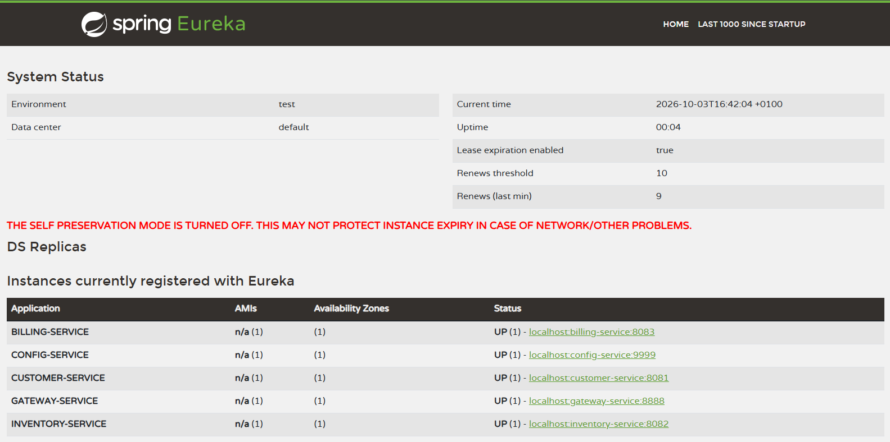
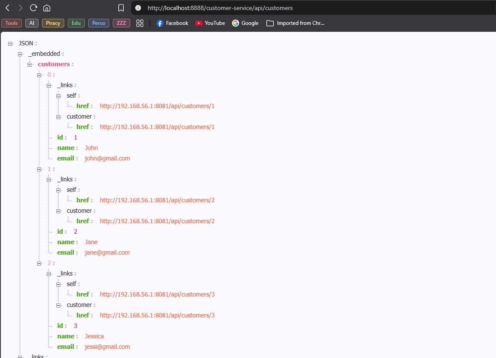
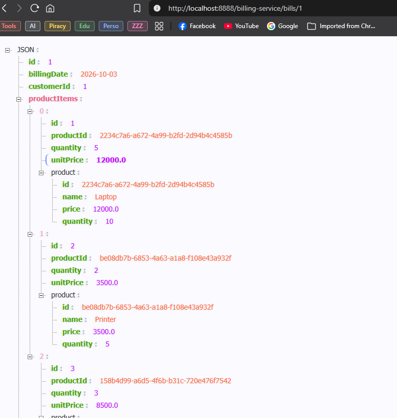
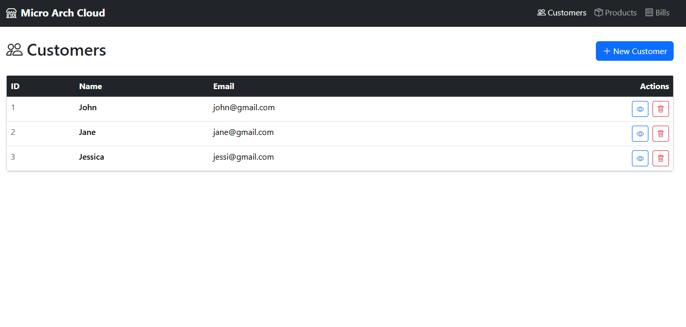
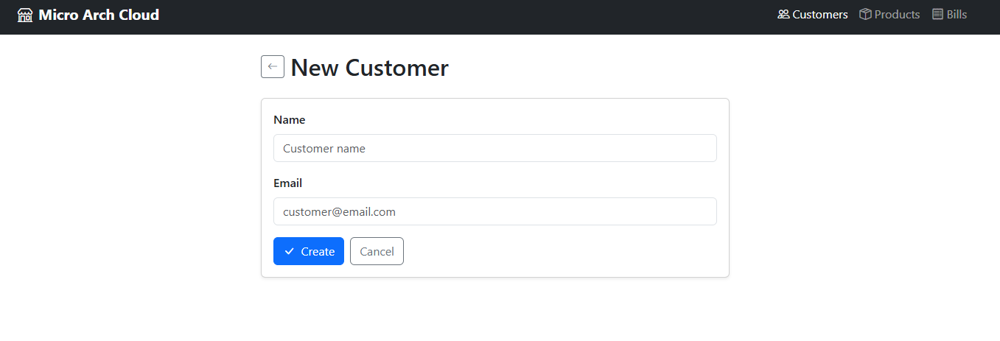
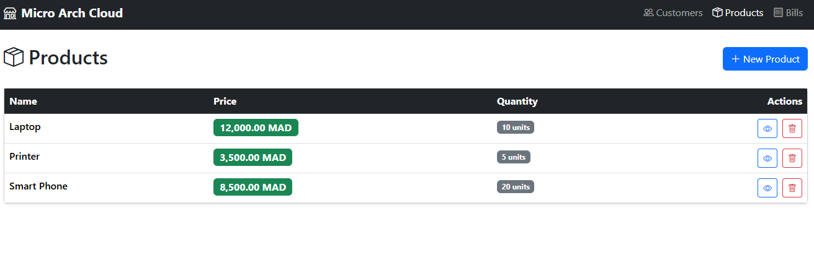
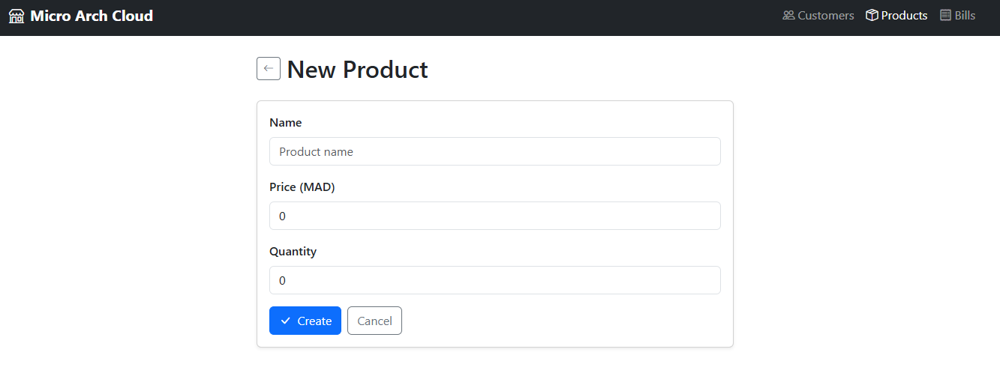
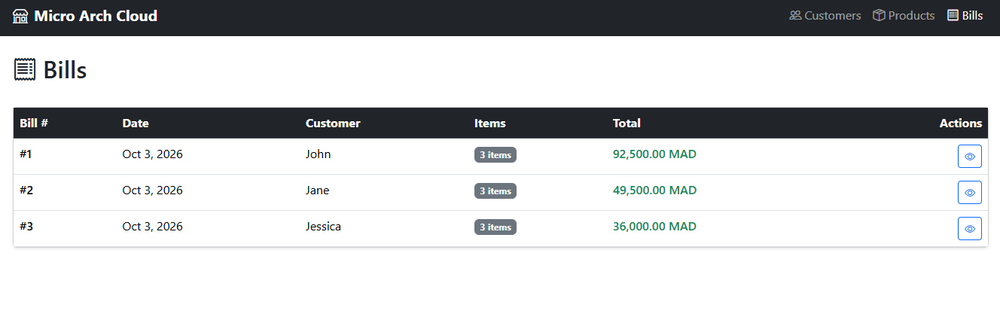

# Rapport de Travaux Pratiques : Architecture Micro-Services avec Spring Cloud et Angular

**Filière :** GLSID - Génie du Logiciel et des Systèmes Informatiques Distribués  
**Encadrant :** Mohamed YOUSSFI  
**Étudiant(e) :** Youness HATTABI

---

## Table des Matières

1. [Introduction](#1-introduction)
2. [Architecture Globale](#2-architecture-globale)
3. [Service de Découverte — Eureka](#3-service-de-découverte--eureka)
4. [Service de Configuration — Config Server](#4-service-de-configuration--config-server)
5. [Micro-service Customer](#5-micro-service-customer)
6. [Micro-service Inventory](#6-micro-service-inventory)
7. [API Gateway — Spring Cloud Gateway](#7-api-gateway--spring-cloud-gateway)
8. [Micro-service Billing avec OpenFeign](#8-micro-service-billing-avec-openfeign)
9. [Client Angular](#9-client-angular)
10. [Tests et Résultats](#10-tests-et-résultats)
11. [Conclusion](#11-conclusion)

---

## 1. Introduction

Les architectures monolithiques atteignent rapidement leurs limites lorsqu'une application grandit : un seul déploiement pour tout modifier, une seule panne pour tout arrêter, une seule technologie imposée à toutes les équipes. Les micro-services répondent à ces contraintes en décomposant l'application en services autonomes, chacun responsable d'un domaine métier précis, déployable et scalable indépendamment.

Ce rapport présente la mise en œuvre d'une architecture micro-services e-commerce complète avec Spring Cloud. L'architecture comprend un registre de services (Eureka), un serveur de configuration centralisé (Spring Cloud Config), trois services métier (Customer, Inventory, Billing), une passerelle API (Spring Cloud Gateway) comme point d'entrée unique, et un client Angular consommant l'ensemble à travers cette passerelle. Le service Billing illustre la communication inter-services via OpenFeign, un client HTTP déclaratif qui résout les adresses de services depuis Eureka.

---

## 2. Architecture Globale

L'ensemble des services communique selon le schéma suivant :

```
                      ┌──────────────────┐
                      │  Config Service  │  :9999
                      │   (Git-backed)   │
                      └────────┬─────────┘
                               │ fournit la configuration
         ┌─────────────────────┼─────────────────────┐
         │                     │                     │
         ▼                     ▼                     ▼
 ┌────────────────┐   ┌──────────────────┐  ┌─────────────────┐
 │Customer Service│   │Inventory Service │  │ Billing Service │
 │    :8081       │   │     :8082        │  │     :8083       │
 └───────┬────────┘   └────────┬─────────┘  └───────┬─────────┘
         │                     │                OpenFeign
         └─────────┬───────────┘             appelle les deux
                   ▼
         ┌───────────────────┐
         │  Eureka Discovery │  :8761
         │     Service       │
         └────────┬──────────┘
                  │ registre de services
                  ▼
         ┌───────────────────┐
         │  Gateway Service  │  :8888
         └────────┬──────────┘
                  │
                  ▼
         ┌──────────────────┐
         │  Client Angular  │  :4200
         └──────────────────┘
```

### Ordre de démarrage obligatoire

| Ordre | Service                    | Port | Raison                                     |
| ----- | -------------------------- | ---- | ------------------------------------------ |
| 1     | Config Service             | 9999 | Tous les autres le consultent au démarrage |
| 2     | Discovery Service (Eureka) | 8761 | Les services doivent pouvoir s'enregistrer |
| 3     | Customer Service           | 8081 | Doit être disponible avant Billing         |
| 4     | Inventory Service          | 8082 | Doit être disponible avant Billing         |
| 5     | Billing Service            | 8083 | Dépend de Customer et Inventory via Feign  |
| 6     | Gateway Service            | 8888 | Point d'entrée final                       |

---

## 3. Service de Découverte — Eureka

Eureka est le **registre de services** de l'architecture. Chaque micro-service se signale à Eureka au démarrage (enregistrement) et en consulte le registre pour localiser les autres services par leur nom logique plutôt que par une adresse IP codée en dur. Cela rend l'architecture résiliente aux changements d'adresse et ouvre la voie au load balancing automatique si plusieurs instances d'un même service tournent simultanément.

### Dépendances (`pom.xml`)

```xml
    <dependencies>
		<dependency>
			<groupId>org.springframework.boot</groupId>
			<artifactId>spring-boot-starter-actuator</artifactId>
		</dependency>
		<dependency>
			<groupId>org.springframework.cloud</groupId>
			<artifactId>spring-cloud-starter-netflix-eureka-server</artifactId>
		</dependency>

		<dependency>
			<groupId>org.springframework.boot</groupId>
			<artifactId>spring-boot-starter-actuator-test</artifactId>
			<scope>test</scope>
		</dependency>
	</dependencies>
```

### Classe principale

L'unique annotation `@EnableEurekaServer` suffit à transformer l'application en registre de services.

```java
import org.springframework.boot.SpringApplication;
import org.springframework.boot.autoconfigure.SpringBootApplication;
import org.springframework.cloud.netflix.eureka.server.EnableEurekaServer;

@SpringBootApplication
@EnableEurekaServer
public class DiscoveryServiceApplication {

	public static void main(String[] args) {
		SpringApplication.run(DiscoveryServiceApplication.class, args);
	}

}
```

### Configuration

```properties
spring.application.name=discovery-service
server.port=8761

eureka.client.register-with-eureka=false
eureka.client.fetch-registry=false

eureka.server.enable-self-preservation=false

management.endpoints.web.exposure.include=*
```

Le tableau de bord Eureka est accessible à `http://localhost:8761`. Il liste en temps réel tous les services enregistrés avec leur statut (UP / DOWN).



---

## 4. Service de Configuration — Config Server

Le Config Server centralise la configuration de tous les micro-services. Au lieu que chaque service maintienne son propre `application.properties` complet, il contacte le Config Server au démarrage et reçoit sa configuration. Le Config Server lui-même lit les fichiers de configuration depuis un dépôt Git, ce qui donne un historique complet des changements de configuration et la possibilité de revenir en arrière.

### Dépendances (`pom.xml`)

```xml
    <dependencies>
		<dependency>
			<groupId>org.springframework.boot</groupId>
			<artifactId>spring-boot-starter-actuator</artifactId>
		</dependency>
		<dependency>
			<groupId>org.springframework.cloud</groupId>
			<artifactId>spring-cloud-config-server</artifactId>
		</dependency>
		<dependency>
			<groupId>org.springframework.cloud</groupId>
			<artifactId>spring-cloud-starter-netflix-eureka-client</artifactId>
		</dependency>

		<dependency>
			<groupId>org.springframework.boot</groupId>
			<artifactId>spring-boot-starter-actuator-test</artifactId>
			<scope>test</scope>
		</dependency>
	</dependencies>
```

### Classe principale

```java
import org.springframework.boot.SpringApplication;
import org.springframework.boot.autoconfigure.SpringBootApplication;
import org.springframework.cloud.config.server.EnableConfigServer;

@SpringBootApplication
@EnableConfigServer
public class ConfigServiceApplication {

	public static void main(String[] args) {
		SpringApplication.run(ConfigServiceApplication.class, args);
	}

}
```

### Configuration

```properties
spring.application.name=config-service
server.port=9999

spring.cloud.config.server.git.uri=file:///C:/Users/Lenovo/.vscode/Projects/ENSET/S5/Micro-Service/config-repo
spring.cloud.config.server.git.default-label=main
spring.cloud.config.server.git.clone-on-start=true

eureka.client.service-url.defaultZone=http://localhost:8761/eureka
eureka.instance.prefer-ip-address=true

management.endpoints.web.exposure.include=*
```

### Fichiers de configuration dans le dépôt Git

La convention de nommage des fichiers est `{nom-du-service}.properties` pour la configuration par défaut et `{nom-du-service}-{profil}.properties` pour les surcharges par profil.

```properties
eureka.client.service-url.defaultZone=http://localhost:8761/eureka
eureka.instance.prefer-ip-address=true
spring.cloud.discovery.enabled=true
management.endpoints.web.exposure.include=*
spring.h2.console.enabled=true
```

```properties
spring.datasource.url=jdbc:h2:mem:customers-db
spring.h2.console.enabled=true
spring.data.rest.base-path=/api
customer.params.x=11
customer.params.y=22
```

```properties
customer.params.x=66
customer.params.y=29
```

```properties
spring.datasource.url=jdbc:h2:mem:products-db
spring.data.rest.base-path=/api
```

```properties
spring.datasource.url=jdbc:h2:mem:bills-db
spring.data.rest.base-path=/api
```

Pour vérifier que le Config Server fonctionne, accédez à :
`http://localhost:9999/customer-service/default` la réponse JSON doit contenir la configuration du customer-service pour le profil `default`.

---

## 5. Micro-service Customer

Le micro-service Customer gère le référentiel des clients. Il expose ses données via Spring Data REST (API HAL automatique) et démontre l'intégration avec le Config Server pour la configuration centralisée et Eureka pour la découverte de service.

### Dépendances (`pom.xml`)

```xml
    <dependencies>
		<dependency>
			<groupId>org.springframework.boot</groupId>
			<artifactId>spring-boot-h2console</artifactId>
		</dependency>
		<dependency>
			<groupId>org.springframework.boot</groupId>
			<artifactId>spring-boot-starter-actuator</artifactId>
		</dependency>
		<dependency>
			<groupId>org.springframework.boot</groupId>
			<artifactId>spring-boot-starter-data-jpa</artifactId>
		</dependency>
		<dependency>
			<groupId>org.springframework.boot</groupId>
			<artifactId>spring-boot-starter-data-rest</artifactId>
		</dependency>
		<dependency>
			<groupId>org.springframework.boot</groupId>
			<artifactId>spring-boot-starter-webmvc</artifactId>
		</dependency>
		<dependency>
			<groupId>org.springframework.cloud</groupId>
			<artifactId>spring-cloud-starter-config</artifactId>
		</dependency>
		<dependency>
			<groupId>org.springframework.cloud</groupId>
			<artifactId>spring-cloud-starter-netflix-eureka-client</artifactId>
		</dependency>

		<dependency>
			<groupId>com.h2database</groupId>
			<artifactId>h2</artifactId>
			<scope>runtime</scope>
		</dependency>
		<dependency>
			<groupId>org.projectlombok</groupId>
			<artifactId>lombok</artifactId>
			<optional>true</optional>
		</dependency>
		<dependency>
    </dependencies>
```

### Entité

```java
import jakarta.persistence.*;
import lombok.*;

@Entity
@NoArgsConstructor @AllArgsConstructor
@Getter @Setter @Builder @ToString
public class Customer {
    @Id
    @GeneratedValue(strategy = GenerationType.IDENTITY)
    private Long id;

    private String name;
    private String email;
}

```

### Repository

```java
import hattabi.youness.customer_service.entities.Customer;
import org.springframework.data.jpa.repository.JpaRepository;
import org.springframework.data.rest.core.annotation.RepositoryRestResource;

@RepositoryRestResource
public interface CustomerRepository extends JpaRepository<Customer, Long> {
}
```

### Projections

```java
import hattabi.youness.customer_service.entities.Customer;
import org.springframework.data.rest.core.config.Projection;

@Projection(name = "full", types = Customer.class)
public interface CustomerProjection {
    Long getId();
    String getName();
    String getEmail();
}
```

```java
import hattabi.youness.customer_service.entities.Customer;
import org.springframework.data.rest.core.config.Projection;

@Projection(name = "email", types = Customer.class)
public interface CustomerEmailProjection {
    String getEmail();
}
```

### Configuration — Exposition des IDs et CORS

Par défaut, Spring Data REST masque les IDs dans les réponses. La classe `RestRepositoryConfig` les expose et configure les en-têtes CORS pour permettre au client Angular d'appeler le service.

```java
import hattabi.youness.customer_service.entities.Customer;
import org.springframework.context.annotation.Configuration;
import org.springframework.data.rest.core.config.RepositoryRestConfiguration;
import org.springframework.data.rest.webmvc.config.RepositoryRestConfigurer;
import org.springframework.web.servlet.config.annotation.CorsRegistry;

@Configuration
public class RestRepositoryConfig implements RepositoryRestConfigurer {

    @Override
    public void configureRepositoryRestConfiguration(
            RepositoryRestConfiguration config, CorsRegistry cors) {
        config.exposeIdsFor(Customer.class);

        cors.addMapping("/**")
            .allowedOrigins("*")
            .allowedMethods("GET", "POST", "PUT", "DELETE", "OPTIONS");
    }
}
```

### Démonstration de la configuration centralisée

Le contrôleur `ConfigTestController` illustre la récupération des paramètres depuis le Config Server. L'annotation `@RefreshScope` permet de recharger les valeurs sans redémarrer le service en appelant `POST /actuator/refresh`.

```java
import org.springframework.boot.context.properties.ConfigurationProperties;

@ConfigurationProperties(prefix = "customer.params")
public record CustomerConfigParams(int x, int y) {}
```

```java
import org.springframework.beans.factory.annotation.Value;
import org.springframework.cloud.context.config.annotation.RefreshScope;
import org.springframework.web.bind.annotation.GetMapping;
import org.springframework.web.bind.annotation.RestController;

import java.util.Map;

@RestController
@RefreshScope
public class ConfigTestController {

    @Value("${customer.params.x}")
    private int x;

    @Value("${customer.params.y}")
    private int y;

    private final CustomerConfigParams params;

    public ConfigTestController(CustomerConfigParams params) {
        this.params = params;
    }

    @GetMapping("/config")
    public Map<String, Object> getConfig() {
        return Map.of("x", x, "y", y, "params", params);
    }
}
```

### Classe principale et données de test

```java
import hattabi.youness.customer_service.config.CustomerConfigParams;
import hattabi.youness.customer_service.entities.Customer;
import hattabi.youness.customer_service.repositories.CustomerRepository;
import org.springframework.boot.CommandLineRunner;
import org.springframework.boot.SpringApplication;
import org.springframework.boot.autoconfigure.SpringBootApplication;
import org.springframework.boot.context.properties.EnableConfigurationProperties;
import org.springframework.context.annotation.Bean;

import java.util.List;

@SpringBootApplication
@EnableConfigurationProperties(CustomerConfigParams.class)
public class CustomerServiceApplication {

	public static void main(String[] args) {
		SpringApplication.run(CustomerServiceApplication.class, args);
	}

	@Bean
    CommandLineRunner commandLineRunner(CustomerRepository customerRepository) {
        return args -> {
            List.of(
                Customer.builder().name("John").email("john@gmail.com").build(),
                Customer.builder().name("Jane").email("jane@gmail.com").build(),
                Customer.builder().name("Jessica").email("jessi@gmail.com").build()
            ).forEach(customerRepository::save);
        };
    }
```

### Configuration locale

```properties
spring.application.name=customer-service
server.port=8081

spring.config.import=optional:configserver:http://localhost:9999

spring.profiles.active=dev
```

---

## 6. Micro-service Inventory

Le micro-service Inventory gère le catalogue de produits. Son architecture est identique à celle du Customer service — Spring Data REST, Eureka, Config Server — avec une particularité : l'ID du produit est une `String` (UUID) assignée manuellement à la création plutôt qu'un entier auto-incrémenté.

### Entité

```java
import jakarta.persistence.*;
import lombok.*;

@Entity
@NoArgsConstructor @AllArgsConstructor
@Getter @Setter @Builder @ToString
public class Product {
    @Id
    private String id;

    private String name;
    private double price;
    private int quantity;
}
```

### Repository

```java
import hattabi.youness.inventory_service.entities.Product;
import org.springframework.data.jpa.repository.JpaRepository;
import org.springframework.data.rest.core.annotation.RepositoryRestResource;

@RepositoryRestResource
public interface ProductRepository extends JpaRepository<Product, String> {
}
```

### Configuration

```java
import hattabi.youness.inventory_service.entities.Product;
import org.springframework.context.annotation.Configuration;
import org.springframework.data.rest.core.config.RepositoryRestConfiguration;
import org.springframework.data.rest.webmvc.config.RepositoryRestConfigurer;
import org.springframework.web.servlet.config.annotation.CorsRegistry;

@Configuration
public class RestRepositoryConfig implements RepositoryRestConfigurer {

    @Override
    public void configureRepositoryRestConfiguration(
            RepositoryRestConfiguration config, CorsRegistry cors) {
        config.exposeIdsFor(Product.class);

        cors.addMapping("/**")
                .allowedOrigins("*")
                .allowedMethods("GET", "POST", "PUT", "DELETE", "OPTIONS");
    }
}
```

### Classe principale et données de test

```java
import org.springframework.boot.CommandLineRunner;
import org.springframework.boot.SpringApplication;
import org.springframework.boot.autoconfigure.SpringBootApplication;
import org.springframework.context.annotation.Bean;
import hattabi.youness.inventory_service.entities.Product;
import hattabi.youness.inventory_service.repositories.ProductRepository;
import java.util.List;
import java.util.UUID;

@SpringBootApplication
public class InventoryServiceApplication {

	public static void main(String[] args) {
		SpringApplication.run(InventoryServiceApplication.class, args);
	}

	@Bean
	CommandLineRunner commandLineRunner(ProductRepository productRepository) {
		return args -> {
			List.of(
					Product.builder()
							.id(UUID.randomUUID().toString())
							.name("Laptop")
							.price(12000.0)
							.quantity(10)
							.build(),
					Product.builder()
							.id(UUID.randomUUID().toString())
							.name("Printer")
							.price(3500.0)
							.quantity(5)
							.build(),
					Product.builder()
							.id(UUID.randomUUID().toString())
							.name("Smart Phone")
							.price(8500.0)
							.quantity(20)
							.build())
					.forEach(productRepository::save);
		};
	}
}
```

### Configuration locale

```properties
spring.application.name=inventory-service
server.port=8082
spring.config.import=optional:configserver:http://localhost:9999
spring.profiles.active=dev
```

---

## 7. API Gateway — Spring Cloud Gateway

La Gateway est le **point d'entrée unique** de l'architecture. Tous les clients (Angular, Postman, etc.) y adressent leurs requêtes ; la Gateway les route vers le bon micro-service en consultant Eureka. Cette approche masque la topologie interne du système et permet d'ajouter des fonctionnalités transversales — authentification, rate limiting, logging — en un seul endroit.

### Dépendances (`pom.xml`)

```xml
    <dependencies>
		<dependency>
			<groupId>org.springframework.boot</groupId>
			<artifactId>spring-boot-starter-actuator</artifactId>
		</dependency>
		<dependency>
			<groupId>org.springframework.cloud</groupId>
			<artifactId>spring-cloud-starter-config</artifactId>
		</dependency>
		<dependency>
			<groupId>org.springframework.cloud</groupId>
			<artifactId>spring-cloud-starter-gateway-server-webflux</artifactId>
		</dependency>
		<dependency>
			<groupId>org.springframework.cloud</groupId>
			<artifactId>spring-cloud-starter-loadbalancer</artifactId>
		</dependency>
		<dependency>
			<groupId>org.springframework.cloud</groupId>
			<artifactId>spring-cloud-starter-netflix-eureka-client</artifactId>
		</dependency>
    </dependencies>
```

### Classe principale — Routage dynamique

Le bean `DiscoveryClientRouteDefinitionLocator` lit la liste des services enregistrés dans Eureka et crée automatiquement une route pour chacun. Un service nommé `customer-service` devient ainsi accessible via la Gateway à l'URL `/customer-service/**`.

```java
import org.springframework.boot.SpringApplication;
import org.springframework.boot.autoconfigure.SpringBootApplication;

@SpringBootApplication
public class GatewayServiceApplication {

	public static void main(String[] args) {
		SpringApplication.run(GatewayServiceApplication.class, args);
	}
}
```

### Configuration

```properties
spring.application.name=gateway-service
server.port=8888

spring.config.import=optional:configserver:http://localhost:9999
spring.cloud.config.enabled=true

eureka.client.service-url.defaultZone=http://localhost:8761/eureka
eureka.instance.prefer-ip-address=true
spring.cloud.discovery.enabled=true

spring.cloud.gateway.server.webflux.discovery.locator.enabled=true
spring.cloud.gateway.server.webflux.discovery.locator.lower-case-service-id=true

spring.cloud.loadbalancer.enabled=true

management.endpoint.gateway.access=read-only
management.endpoints.web.exposure.include=*

spring.cloud.gateway.globalcors.cors-configurations.[/**].allowed-origins=http://localhost:4200
spring.cloud.gateway.globalcors.cors-configurations.[/**].allowed-methods=GET,POST,PUT,DELETE,OPTIONS
spring.cloud.gateway.globalcors.cors-configurations.[/**].allowed-headers=*
```

### Pattern d'URL via la Gateway

| Service   | URL directe                           | URL via Gateway                                        |
| --------- | ------------------------------------- | ------------------------------------------------------ |
| Customers | `http://localhost:8081/api/customers` | `http://localhost:8888/customer-service/api/customers` |
| Products  | `http://localhost:8082/api/products`  | `http://localhost:8888/inventory-service/api/products` |
| Bills     | `http://localhost:8083/bills`         | `http://localhost:8888/billing-service/bills`          |



---

## 8. Micro-service Billing avec OpenFeign

Le Billing Service est le service le plus riche de l'architecture. Il gère les factures et démontre la **communication inter-services** grâce à OpenFeign. OpenFeign est un client HTTP déclaratif : on définit une interface Java annotée, et Spring génère automatiquement l'implémentation qui appelle l'autre service via HTTP, en résolvant son adresse depuis Eureka.

La dépendance HATEOAS est nécessaire car Customer et Inventory Services utilisent Spring Data REST, qui retourne ses réponses au format HAL (`{ _embedded: { customers: [...] } }`) — `PagedModel` permet de désérialiser ce format.

### Dépendances (`pom.xml`)

```xml
    <dependencies>
		<dependency>
			<groupId>org.springframework.boot</groupId>
			<artifactId>spring-boot-h2console</artifactId>
		</dependency>
		<dependency>
			<groupId>org.springframework.boot</groupId>
			<artifactId>spring-boot-starter-actuator</artifactId>
		</dependency>
		<dependency>
			<groupId>org.springframework.boot</groupId>
			<artifactId>spring-boot-starter-data-jpa</artifactId>
		</dependency>
		<dependency>
			<groupId>org.springframework.boot</groupId>
			<artifactId>spring-boot-starter-data-rest</artifactId>
		</dependency>
		<dependency>
			<groupId>org.springframework.boot</groupId>
			<artifactId>spring-boot-starter-webmvc</artifactId>
		</dependency>
		<dependency>
			<groupId>org.springframework.cloud</groupId>
			<artifactId>spring-cloud-starter-config</artifactId>
		</dependency>
		<dependency>
			<groupId>org.springframework.cloud</groupId>
			<artifactId>spring-cloud-starter-netflix-eureka-client</artifactId>
		</dependency>
		<dependency>
			<groupId>org.springframework.cloud</groupId>
			<artifactId>spring-cloud-starter-openfeign</artifactId>
		</dependency>
		<dependency>
			<groupId>org.springframework.boot</groupId>
			<artifactId>spring-boot-starter-hateoas</artifactId>
		</dependency>
		<dependency>
			<groupId>com.h2database</groupId>
			<artifactId>h2</artifactId>
			<scope>runtime</scope>
		</dependency>
		<dependency>
			<groupId>org.projectlombok</groupId>
			<artifactId>lombok</artifactId>
			<optional>true</optional>
		</dependency>
    </dependencies>
```

### Clients Feign

Chaque interface `@FeignClient` correspond à un micro-service cible. L'attribut `name` doit correspondre exactement au `spring.application.name` du service cible. Feign consulte Eureka pour résoudre l'adresse réelle et effectue le load balancing automatiquement.

```java
import hattabi.youness.billing_service.model.Customer;
import org.springframework.cloud.openfeign.FeignClient;
import org.springframework.hateoas.PagedModel;
import org.springframework.web.bind.annotation.GetMapping;
import org.springframework.web.bind.annotation.PathVariable;

@FeignClient(name = "customer-service")
public interface CustomerRestClient {

    @GetMapping("/api/customers/{id}")
    Customer getCustomerById(@PathVariable Long id);

    @GetMapping("/api/customers")
    PagedModel<Customer> getAllCustomers();
}
```

```java
import hattabi.youness.billing_service.model.Product;
import org.springframework.cloud.openfeign.FeignClient;
import org.springframework.hateoas.PagedModel;
import org.springframework.web.bind.annotation.GetMapping;
import org.springframework.web.bind.annotation.PathVariable;

@FeignClient(name = "inventory-service")
public interface ProductRestClient {

    @GetMapping("/api/products/{id}")
    Product getProductById(@PathVariable String id);

    @GetMapping("/api/products")
    PagedModel<Product> getAllProducts();
}
```

### Modèles locaux

Le Billing Service définit ses propres copies des modèles Customer et Product. Il n'y a pas de dépendance entre services au niveau du code — chaque service est autonome.

```java
import lombok.*;

@Getter
@Setter
@ToString
@NoArgsConstructor
@AllArgsConstructor
public class Customer {
    private Long id;
    private String name;
    private String email;
}
```

```java
import lombok.*;

@Getter
@Setter
@ToString
@NoArgsConstructor
@AllArgsConstructor
public class Product {
    private String id;
    private String name;
    private double price;
    private int quantity;
}
```

### Entités

```java
import jakarta.persistence.*;
import lombok.*;
import hattabi.youness.billing_service.model.Customer;

import java.time.LocalDate;
import java.util.ArrayList;
import java.util.List;

@Entity
@NoArgsConstructor
@AllArgsConstructor
@Getter
@Setter
@Builder
public class Bill {

    @Id
    @GeneratedValue(strategy = GenerationType.IDENTITY)
    private Long id;

    private LocalDate billingDate;

    private Long customerId;

    @OneToMany(mappedBy = "bill", fetch = FetchType.EAGER)
    private List<ProductItem> productItems = new ArrayList<>();

    @Transient
    private Customer customer;
}
```

```java
import com.fasterxml.jackson.annotation.JsonProperty;
import jakarta.persistence.*;
import lombok.*;
import hattabi.youness.billing_service.model.Product;

@Entity
@NoArgsConstructor
@AllArgsConstructor
@Getter
@Setter
@Builder
public class ProductItem {

    @Id
    @GeneratedValue(strategy = GenerationType.IDENTITY)
    private Long id;

    private String productId;

    @ManyToOne
    @JsonProperty(access = JsonProperty.Access.WRITE_ONLY)
    private Bill bill;

    private int quantity;
    private double unitPrice;

    @Transient
    private Product product;
}
```

### Repositories

```java
import hattabi.youness.billing_service.entities.Bill;
import org.springframework.data.jpa.repository.JpaRepository;
import org.springframework.data.rest.core.annotation.RepositoryRestResource;

@RepositoryRestResource
public interface BillRepository extends JpaRepository<Bill, Long> {
}
```

```java
import hattabi.youness.billing_service.entities.ProductItem;
import org.springframework.data.jpa.repository.JpaRepository;

public interface ProductItemRepository extends JpaRepository<ProductItem, Long> {
}
```

### Contrôleur REST

Le contrôleur enrichit chaque facture avec les données client et produit en appelant les autres services via Feign avant de retourner la réponse.

```java
import hattabi.youness.billing_service.entities.Bill;
import hattabi.youness.billing_service.feign.CustomerRestClient;
import hattabi.youness.billing_service.feign.ProductRestClient;
import hattabi.youness.billing_service.repositories.BillRepository;
import lombok.RequiredArgsConstructor;
import org.springframework.web.bind.annotation.*;

import java.util.List;

@RestController
@RequiredArgsConstructor
public class BillRestController {

    private final BillRepository billRepository;
    private final CustomerRestClient customerRestClient;
    private final ProductRestClient productRestClient;

    @GetMapping("/bills")
    public List<Bill> getAllBills() {
        List<Bill> bills = billRepository.findAll();
        bills.forEach(bill -> {
            bill.setCustomer(customerRestClient.getCustomerById(bill.getCustomerId()));
            bill.getProductItems()
                    .forEach(item -> item.setProduct(productRestClient.getProductById(item.getProductId())));
        });
        return bills;
    }

    @GetMapping("/bills/{id}")
    public Bill getBillById(@PathVariable Long id) {
        Bill bill = billRepository.findById(id)
                .orElseThrow(() -> new RuntimeException("Bill not found: " + id));

        bill.setCustomer(customerRestClient.getCustomerById(bill.getCustomerId()));

        bill.getProductItems().forEach(item -> item.setProduct(productRestClient.getProductById(item.getProductId())));

        return bill;
    }
}
```

### Classe principale et données de test

```java
import org.springframework.boot.CommandLineRunner;
import org.springframework.boot.SpringApplication;
import org.springframework.boot.autoconfigure.SpringBootApplication;
import org.springframework.cloud.openfeign.EnableFeignClients;
import org.springframework.context.annotation.Bean;
import hattabi.youness.billing_service.entities.Bill;
import hattabi.youness.billing_service.entities.ProductItem;
import hattabi.youness.billing_service.feign.CustomerRestClient;
import hattabi.youness.billing_service.feign.ProductRestClient;
import hattabi.youness.billing_service.model.Customer;
import hattabi.youness.billing_service.model.Product;
import hattabi.youness.billing_service.repositories.BillRepository;
import hattabi.youness.billing_service.repositories.ProductItemRepository;

import java.time.LocalDate;
import java.util.Collection;
import java.util.Random;

@SpringBootApplication
@EnableFeignClients
public class BillingServiceApplication {

	public static void main(String[] args) {
		SpringApplication.run(BillingServiceApplication.class, args);
	}

	@Bean
	CommandLineRunner commandLineRunner(
			BillRepository billRepository,
			ProductItemRepository productItemRepository,
			CustomerRestClient customerRestClient,
			ProductRestClient productRestClient) {

		return args -> {
			Collection<Customer> customers = customerRestClient.getAllCustomers().getContent();
			Collection<Product> products = productRestClient.getAllProducts().getContent();

			customers.forEach(customer -> {
				Bill bill = Bill.builder()
						.billingDate(LocalDate.now())
						.customerId(customer.getId())
						.build();
				billRepository.save(bill);

				products.forEach(product -> {
					ProductItem item = ProductItem.builder()
							.bill(bill)
							.productId(product.getId())
							.quantity(1 + new Random().nextInt(5))
							.unitPrice(product.getPrice())
							.build();
					productItemRepository.save(item);
				});
			});
		};
	}
}
```

### Configuration locale

```properties
spring.application.name=billing-service
server.port=8083
spring.config.import=optional:configserver:http://localhost:9999
spring.profiles.active=dev
```



---

## 9. Client Angular

Le client Angular est l'interface utilisateur de l'application. Il communique exclusivement avec la Gateway (`http://localhost:8888`), sans connaissance de la topologie interne des services. Il est construit avec Angular standalone components (sans NgModule) et Bootstrap 5 pour le style.

### Initialisation du projet

```bash
ng new micro-arch-app --routing --style=css

npm install bootstrap bootstrap-icons
ng generate service services/customer
ng generate service services/product
ng generate service services/bill

ng generate component components/customers
ng generate component components/customer-detail
ng generate component components/products
ng generate component components/product-detail
ng generate component components/bills
ng generate component components/bill-detail
ng generate component components/navbar
```

### Structure du projet

```
src/
├── app/
│   ├── app.ts
│   ├── app.config.ts          ← provideHttpClient() ici
│   ├── app.routes.ts
│   ├── models/
│   │   ├── customer.model.ts  ← interface + CustomerPage (HAL)
│   │   ├── product.model.ts   ← interface + ProductPage (HAL)
│   │   └── bill.model.ts      ← Bill, ProductItem
│   ├── services/
│   │   ├── customer.ts
│   │   ├── product.ts
│   │   └── bill.ts
│   └── components/
│       ├── navbar/
│       ├── customers/          ← liste avec suppression
│       ├── customer-detail/    ← formulaire création/édition
│       ├── products/           ← liste avec suppression
│       ├── product-detail/     ← formulaire création/édition
│       ├── bills/              ← liste avec total calculé
│       └── bill-detail/        ← détail avec items enrichis
└── environments/
    └── environment.ts          ← gatewayUrl: 'http://localhost:8888'
```

### Configuration `angular.json`

```json
    "styles": [
        "node_modules/bootstrap/dist/css/bootstrap.min.css",
        "node_modules/bootstrap-icons/font/bootstrap-icons.css",
        "src/styles.css"
    ],
    "scripts": [
        "node_modules/bootstrap/dist/js/bootstrap.bundle.min.js"
    ],
```

### Environnement

```typescript
export const environment = {
  production: false,
  gatewayUrl: "http://localhost:8888",
};
```

### Modèles TypeScript

```typescript
export interface Customer {
  id: number;
  name: string;
  email: string;
}

export interface CustomerPage {
  _embedded: {
    customers: Customer[];
  };
  page: {
    size: number;
    totalElements: number;
    totalPages: number;
    number: number;
  };
}
```

```typescript
export interface Product {
  id: string;
  name: string;
  price: number;
  quantity: number;
}

export interface ProductPage {
  _embedded: {
    products: Product[];
  };
  page: {
    size: number;
    totalElements: number;
    totalPages: number;
    number: number;
  };
}
```

```typescript
import { Customer } from "./customer.model";
import { Product } from "./product.model";

export interface ProductItem {
  id: number;
  productId: string;
  quantity: number;
  unitPrice: number;
  product?: Product;
}

export interface Bill {
  id: number;
  billingDate: string;
  customerId: number;
  customer?: Customer;
  productItems: ProductItem[];
}
```

### Services Angular

Chaque service injecte `HttpClient` et cible la Gateway. Les réponses Spring Data REST sont "désemballées" via l'opérateur RxJS `map` pour extraire le tableau depuis `_embedded`.

```typescript
import { Injectable } from "@angular/core";
import { HttpClient } from "@angular/common/http";
import { Observable, map } from "rxjs";
import { Customer, CustomerPage } from "../models/customer.model";
import { environment } from "../../environments/environment";

@Injectable({
  providedIn: "root",
})
export class CustomerService {
  private baseUrl = `${environment.gatewayUrl}/customer-service/api/customers`;

  constructor(private http: HttpClient) {}

  getAll(): Observable<Customer[]> {
    return this.http
      .get<CustomerPage>(this.baseUrl)
      .pipe(map((page) => page._embedded.customers));
  }

  getById(id: number): Observable<Customer> {
    return this.http.get<Customer>(`${this.baseUrl}/${id}`);
  }

  create(customer: Partial<Customer>): Observable<Customer> {
    return this.http.post<Customer>(this.baseUrl, customer);
  }

  update(id: number, customer: Partial<Customer>): Observable<Customer> {
    return this.http.put<Customer>(`${this.baseUrl}/${id}`, customer);
  }

  delete(id: number): Observable<void> {
    return this.http.delete<void>(`${this.baseUrl}/${id}`);
  }
}
```

```typescript
import { Injectable } from "@angular/core";
import { HttpClient } from "@angular/common/http";
import { Observable, map } from "rxjs";
import { Product, ProductPage } from "../models/product.model";
import { environment } from "../../environments/environment";

@Injectable({
  providedIn: "root",
})
export class ProductService {
  private baseUrl = `${environment.gatewayUrl}/inventory-service/api/products`;

  constructor(private http: HttpClient) {}

  getAll(): Observable<Product[]> {
    return this.http
      .get<ProductPage>(this.baseUrl)
      .pipe(map((page) => page._embedded.products));
  }

  getById(id: string): Observable<Product> {
    return this.http.get<Product>(`${this.baseUrl}/${id}`);
  }

  create(product: Partial<Product>): Observable<Product> {
    return this.http.post<Product>(this.baseUrl, product);
  }

  update(id: string, product: Partial<Product>): Observable<Product> {
    return this.http.put<Product>(`${this.baseUrl}/${id}`, product);
  }

  delete(id: string): Observable<void> {
    return this.http.delete<void>(`${this.baseUrl}/${id}`);
  }
}
```

```typescript
import { Injectable } from "@angular/core";
import { HttpClient } from "@angular/common/http";
import { Observable } from "rxjs";
import { Bill } from "../models/bill.model";
import { environment } from "../../environments/environment";

@Injectable({
  providedIn: "root",
})
export class BillService {
  private baseUrl = `${environment.gatewayUrl}/billing-service/bills`;

  constructor(private http: HttpClient) {}

  getAll(): Observable<Bill[]> {
    return this.http.get<Bill[]>(this.baseUrl);
  }

  getById(id: number): Observable<Bill> {
    return this.http.get<Bill>(`${this.baseUrl}/${id}`);
  }
}
```

### Configuration de l'application

```typescript
import {
  ApplicationConfig,
  provideBrowserGlobalErrorListeners,
} from "@angular/core";
import { provideRouter } from "@angular/router";
import { provideHttpClient } from "@angular/common/http";
import { routes } from "./app.routes";
import {
  provideClientHydration,
  withEventReplay,
} from "@angular/platform-browser";

export const appConfig: ApplicationConfig = {
  providers: [
    provideBrowserGlobalErrorListeners(),
    provideRouter(routes),
    provideHttpClient(),
    provideClientHydration(withEventReplay()),
  ],
};
```

### Routes

```typescript
import { Routes } from "@angular/router";
import { CustomersComponent } from "./components/customers/customers";
import { CustomerDetailComponent } from "./components/customer-detail/customer-detail";
import { ProductsComponent } from "./components/products/products";
import { ProductDetailComponent } from "./components/product-detail/product-detail";
import { BillsComponent } from "./components/bills/bills";
import { BillDetailComponent } from "./components/bill-detail/bill-detail";

export const routes: Routes = [
  { path: "", redirectTo: "customers", pathMatch: "full" },
  { path: "customers", component: CustomersComponent },
  { path: "customers/:id", component: CustomerDetailComponent },
  { path: "products", component: ProductsComponent },
  { path: "products/:id", component: ProductDetailComponent },
  { path: "bills", component: BillsComponent },
  { path: "bills/:id", component: BillDetailComponent },
];
```

### Composants

```typescript
import { Component } from '@angular/core';
import { RouterLink, RouterLinkActive } from '@angular/router';

@Component({
  selector: 'app-navbar',
  standalone: true,
  imports: [RouterLink, RouterLinkActive],
  templateUrl: './navbar.html',
  styleUrl: './navbar.css',
})
export class Navbar {}
<nav class="navbar navbar-expand-lg navbar-dark bg-dark">
  <div class="container">
    <a class="navbar-brand fw-bold" routerLink="/">
      <i class="bi bi-shop me-2"></i>Micro Arch Cloud
    </a>

    <button
      class="navbar-toggler"
      type="button"
      data-bs-toggle="collapse"
      data-bs-target="#navMenu"
    >
      <span class="navbar-toggler-icon"></span>
    </button>

    <div class="collapse navbar-collapse" id="navMenu">
      <ul class="navbar-nav ms-auto">
        <li class="nav-item">
          <a class="nav-link" routerLink="/customers" routerLinkActive="active">
            <i class="bi bi-people me-1"></i>Customers
          </a>
        </li>
        <li class="nav-item">
          <a class="nav-link" routerLink="/products" routerLinkActive="active">
            <i class="bi bi-box-seam me-1"></i>Products
          </a>
        </li>
        <li class="nav-item">
          <a class="nav-link" routerLink="/bills" routerLinkActive="active">
            <i class="bi bi-receipt me-1"></i>Bills
          </a>
        </li>
      </ul>
    </div>
  </div>
</nav>
```

```typescript
import { Component, OnInit } from '@angular/core';
import { RouterLink } from '@angular/router';
import { CommonModule } from '@angular/common';
import { CustomerService } from '../../services/customer';
import { Customer } from '../../models/customer.model';

@Component({
  selector: 'app-customers',
  standalone: true,
  imports: [CommonModule, RouterLink],
  templateUrl: './customers.html',
  styleUrl: './customers.css',
})
export class CustomersComponent implements OnInit {
  customers: Customer[] = [];
  loading = true;
  error = '';

  constructor(private customerService: CustomerService) {}

  ngOnInit(): void {
    this.loadCustomers();
  }

  loadCustomers(): void {
    this.loading = true;
    this.customerService.getAll().subscribe({
      next: (data) => {
        this.customers = data;
        this.loading = false;
      },
      error: (err) => {
        this.error = 'Failed to load customers. Is the gateway running?';
        this.loading = false;
        console.error(err);
      },
    });
  }

  deleteCustomer(id: number): void {
    if (!confirm('Delete this customer?')) return;
    this.customerService.delete(id).subscribe({
      next: () => this.loadCustomers(),
      error: () => (this.error = 'Failed to delete customer.'),
    });
  }
}
<div class="d-flex justify-content-between align-items-center mb-4">
  <h2><i class="bi bi-people me-2"></i>Customers</h2>
  <a routerLink="/customers/new" class="btn btn-primary">
    <i class="bi bi-plus-lg me-1"></i>New Customer
  </a>
</div>

<!-- Error -->
<div *ngIf="error" class="alert alert-danger">{{ error }}</div>

<!-- Loading spinner -->
<div *ngIf="loading" class="text-center py-5">
  <div class="spinner-border text-primary" role="status">
    <span class="visually-hidden">Loading...</span>
  </div>
</div>

<!-- Table -->
<div *ngIf="!loading && !error" class="card shadow-sm">
  <div class="card-body p-0">
    <table class="table table-hover mb-0">
      <thead class="table-dark">
        <tr>
          <th>ID</th>
          <th>Name</th>
          <th>Email</th>
          <th class="text-end">Actions</th>
        </tr>
      </thead>
      <tbody>
        <tr *ngFor="let customer of customers">
          <td class="text-muted">{{ customer.id }}</td>
          <td class="fw-semibold">{{ customer.name }}</td>
          <td>{{ customer.email }}</td>
          <td class="text-end">
            <a
              [routerLink]="['/customers', customer.id]"
              class="btn btn-sm btn-outline-primary me-2"
            >
              <i class="bi bi-eye"></i>
            </a>
            <button class="btn btn-sm btn-outline-danger" (click)="deleteCustomer(customer.id)">
              <i class="bi bi-trash"></i>
            </button>
          </td>
        </tr>
        <tr *ngIf="customers.length === 0">
          <td colspan="4" class="text-center text-muted py-4">No customers found.</td>
        </tr>
      </tbody>
    </table>
  </div>
</div>
```

```typescript
import { Component, OnInit } from '@angular/core';
import { ActivatedRoute, Router, RouterLink } from '@angular/router';
import { CommonModule } from '@angular/common';
import { FormsModule } from '@angular/forms';
import { CustomerService } from '../../services/customer';
import { Customer } from '../../models/customer.model';

@Component({
  selector: 'app-customer-detail',
  standalone: true,
  imports: [CommonModule, RouterLink, FormsModule],
  templateUrl: './customer-detail.html',
  styleUrl: './customer-detail.css',
})
export class CustomerDetailComponent implements OnInit {
  customer: Customer = { id: 0, name: '', email: '' };
  loading = true;
  saving = false;
  error = '';
  isNew = false;

  constructor(
    private route: ActivatedRoute,
    private router: Router,
    private customerService: CustomerService,
  ) {}

  ngOnInit(): void {
    const id = this.route.snapshot.paramMap.get('id');
    if (id === 'new') {
      this.isNew = true;
      this.loading = false;
    } else {
      this.customerService.getById(Number(id)).subscribe({
        next: (data) => {
          this.customer = data;
          this.loading = false;
        },
        error: () => {
          this.error = 'Customer not found.';
          this.loading = false;
        },
      });
    }
  }

  save(): void {
    this.saving = true;
    const action = this.isNew
      ? this.customerService.create(this.customer)
      : this.customerService.update(this.customer.id, this.customer);

    action.subscribe({
      next: () => this.router.navigate(['/customers']),
      error: () => {
        this.error = 'Failed to save.';
        this.saving = false;
      },
    });
  }
}
<div class="row justify-content-center">
  <div class="col-md-6">
    <div class="d-flex align-items-center mb-4 gap-2">
      <a routerLink="/customers" class="btn btn-outline-secondary btn-sm">
        <i class="bi bi-arrow-left"></i>
      </a>
      <h2 class="mb-0">
        {{ isNew ? 'New Customer' : 'Edit Customer' }}
      </h2>
    </div>

    <div *ngIf="error" class="alert alert-danger">{{ error }}</div>

    <div *ngIf="loading" class="text-center py-5">
      <div class="spinner-border text-primary" role="status"></div>
    </div>

    <div *ngIf="!loading" class="card shadow-sm">
      <div class="card-body">
        <div class="mb-3">
          <label class="form-label fw-semibold">Name</label>
          <input
            type="text"
            class="form-control"
            [(ngModel)]="customer.name"
            placeholder="Customer name"
          />
        </div>
        <div class="mb-3">
          <label class="form-label fw-semibold">Email</label>
          <input
            type="email"
            class="form-control"
            [(ngModel)]="customer.email"
            placeholder="customer@email.com"
          />
        </div>
        <div class="d-flex gap-2">
          <button class="btn btn-primary" (click)="save()" [disabled]="saving">
            <span *ngIf="saving" class="spinner-border spinner-border-sm me-2"></span>
            <i *ngIf="!saving" class="bi bi-check-lg me-1"></i>
            {{ isNew ? 'Create' : 'Update' }}
          </button>
          <a routerLink="/customers" class="btn btn-outline-secondary">Cancel</a>
        </div>
      </div>
    </div>
  </div>
</div>
```

```typescript
import { Component, OnInit } from '@angular/core';
import { RouterLink } from '@angular/router';
import { CommonModule } from '@angular/common';
import { ProductService } from '../../services/product';
import { Product } from '../../models/product.model';

@Component({
  selector: 'app-products',
  standalone: true,
  imports: [CommonModule, RouterLink],
  templateUrl: './products.html',
  styleUrl: './products.css',
})
export class ProductsComponent implements OnInit {
  products: Product[] = [];
  loading = true;
  error = '';

  constructor(private productService: ProductService) {}

  ngOnInit(): void {
    this.loadProducts();
  }

  loadProducts(): void {
    this.loading = true;
    this.productService.getAll().subscribe({
      next: (data) => {
        this.products = data;
        this.loading = false;
      },
      error: () => {
        this.error = 'Failed to load products.';
        this.loading = false;
      },
    });
  }

  deleteProduct(id: string): void {
    if (!confirm('Delete this product?')) return;
    this.productService.delete(id).subscribe({
      next: () => this.loadProducts(),
      error: () => (this.error = 'Failed to delete product.'),
    });
  }
}
<div class="d-flex justify-content-between align-items-center mb-4">
  <h2><i class="bi bi-box-seam me-2"></i>Products</h2>
  <a routerLink="/products/new" class="btn btn-primary">
    <i class="bi bi-plus-lg me-1"></i>New Product
  </a>
</div>

<div *ngIf="error" class="alert alert-danger">{{ error }}</div>

<div *ngIf="loading" class="text-center py-5">
  <div class="spinner-border text-primary" role="status"></div>
</div>

<div *ngIf="!loading && !error" class="card shadow-sm">
  <div class="card-body p-0">
    <table class="table table-hover mb-0">
      <thead class="table-dark">
        <tr>
          <th>Name</th>
          <th>Price</th>
          <th>Quantity</th>
          <th class="text-end">Actions</th>
        </tr>
      </thead>
      <tbody>
        <tr *ngFor="let product of products">
          <td class="fw-semibold">{{ product.name }}</td>
          <td>
            <span class="badge bg-success fs-6"> {{ product.price | number: '1.2-2' }} MAD </span>
          </td>
          <td>
            <span [class]="product.quantity < 5 ? 'badge bg-danger' : 'badge bg-secondary'">
              {{ product.quantity }} units
            </span>
          </td>
          <td class="text-end">
            <a [routerLink]="['/products', product.id]" class="btn btn-sm btn-outline-primary me-2">
              <i class="bi bi-eye"></i>
            </a>
            <button class="btn btn-sm btn-outline-danger" (click)="deleteProduct(product.id)">
              <i class="bi bi-trash"></i>
            </button>
          </td>
        </tr>
        <tr *ngIf="products.length === 0">
          <td colspan="4" class="text-center text-muted py-4">No products found.</td>
        </tr>
      </tbody>
    </table>
  </div>
</div>
```

```typescript
import { Component, OnInit } from '@angular/core';
import { ActivatedRoute, Router, RouterLink } from '@angular/router';
import { CommonModule } from '@angular/common';
import { FormsModule } from '@angular/forms';
import { ProductService } from '../../services/product';
import { Product } from '../../models/product.model';

@Component({
  selector: 'app-product-detail',
  standalone: true,
  imports: [CommonModule, RouterLink, FormsModule],
  templateUrl: './product-detail.html',
  styleUrl: './product-detail.css',
})
export class ProductDetailComponent implements OnInit {
  product: Product = { id: '', name: '', price: 0, quantity: 0 };
  loading = true;
  saving = false;
  error = '';
  isNew = false;

  constructor(
    private route: ActivatedRoute,
    private router: Router,
    private productService: ProductService,
  ) {}

  ngOnInit(): void {
    const id = this.route.snapshot.paramMap.get('id');
    if (id === 'new') {
      this.isNew = true;
      this.loading = false;
    } else {
      this.productService.getById(id!).subscribe({
        next: (data) => {
          this.product = data;
          this.loading = false;
        },
        error: () => {
          this.error = 'Product not found.';
          this.loading = false;
        },
      });
    }
  }

  save(): void {
    this.saving = true;
    const action = this.isNew
      ? this.productService.create(this.product)
      : this.productService.update(this.product.id, this.product);

    action.subscribe({
      next: () => this.router.navigate(['/products']),
      error: () => {
        this.error = 'Failed to save.';
        this.saving = false;
      },
    });
  }
}
<div class="row justify-content-center">
  <div class="col-md-6">
    <div class="d-flex align-items-center mb-4 gap-2">
      <a routerLink="/products" class="btn btn-outline-secondary btn-sm">
        <i class="bi bi-arrow-left"></i>
      </a>
      <h2 class="mb-0">{{ isNew ? 'New Product' : 'Edit Product' }}</h2>
    </div>

    <div *ngIf="error" class="alert alert-danger">{{ error }}</div>

    <div *ngIf="loading" class="text-center py-5">
      <div class="spinner-border text-primary" role="status"></div>
    </div>

    <div *ngIf="!loading" class="card shadow-sm">
      <div class="card-body">
        <div class="mb-3">
          <label class="form-label fw-semibold">Name</label>
          <input
            type="text"
            class="form-control"
            [(ngModel)]="product.name"
            placeholder="Product name"
          />
        </div>
        <div class="mb-3">
          <label class="form-label fw-semibold">Price (MAD)</label>
          <input type="number" class="form-control" [(ngModel)]="product.price" min="0" />
        </div>
        <div class="mb-3">
          <label class="form-label fw-semibold">Quantity</label>
          <input type="number" class="form-control" [(ngModel)]="product.quantity" min="0" />
        </div>
        <div class="d-flex gap-2">
          <button class="btn btn-primary" (click)="save()" [disabled]="saving">
            <span *ngIf="saving" class="spinner-border spinner-border-sm me-2"></span>
            <i *ngIf="!saving" class="bi bi-check-lg me-1"></i>
            {{ isNew ? 'Create' : 'Update' }}
          </button>
          <a routerLink="/products" class="btn btn-outline-secondary">Cancel</a>
        </div>
      </div>
    </div>
  </div>
</div>
```

```typescript
import { Component, OnInit } from '@angular/core';
import { RouterLink } from '@angular/router';
import { CommonModule } from '@angular/common';
import { BillService } from '../../services/bill';
import { Bill } from '../../models/bill.model';

@Component({
  selector: 'app-bills',
  standalone: true,
  imports: [CommonModule, RouterLink],
  templateUrl: './bills.html',
  styleUrl: './bills.css',
})
export class BillsComponent implements OnInit {
  bills: Bill[] = [];
  loading = true;
  error = '';

  constructor(private billService: BillService) {}

  ngOnInit(): void {
    this.billService.getAll().subscribe({
      next: (data) => {
        this.bills = data;
        this.loading = false;
      },
      error: () => {
        this.error = 'Failed to load bills.';
        this.loading = false;
      },
    });
  }

  getTotal(bill: Bill): number {
    return bill.productItems.reduce((sum, item) => sum + item.unitPrice * item.quantity, 0);
  }
}
<div class="d-flex justify-content-between align-items-center mb-4">
  <h2><i class="bi bi-receipt me-2"></i>Bills</h2>
</div>

<div *ngIf="error" class="alert alert-danger">{{ error }}</div>

<div *ngIf="loading" class="text-center py-5">
  <div class="spinner-border text-primary" role="status"></div>
</div>

<div *ngIf="!loading && !error" class="card shadow-sm">
  <div class="card-body p-0">
    <table class="table table-hover mb-0">
      <thead class="table-dark">
        <tr>
          <th>Bill #</th>
          <th>Date</th>
          <th>Customer</th>
          <th>Items</th>
          <th>Total</th>
          <th class="text-end">Actions</th>
        </tr>
      </thead>
      <tbody>
        <tr *ngFor="let bill of bills">
          <td class="fw-semibold">#{{ bill.id }}</td>
          <td>{{ bill.billingDate | date: 'mediumDate' }}</td>
          <td>
            <span *ngIf="bill.customer; else noCustomer">
              {{ bill.customer.name }}
            </span>
            <ng-template #noCustomer>
              <span class="text-muted">Customer #{{ bill.customerId }}</span>
            </ng-template>
          </td>
          <td>
            <span class="badge bg-secondary"> {{ bill.productItems.length }} items </span>
          </td>
          <td class="fw-semibold text-success">{{ getTotal(bill) | number: '1.2-2' }} MAD</td>
          <td class="text-end">
            <a [routerLink]="['/bills', bill.id]" class="btn btn-sm btn-outline-primary">
              <i class="bi bi-eye"></i>
            </a>
          </td>
        </tr>
        <tr *ngIf="bills.length === 0">
          <td colspan="6" class="text-center text-muted py-4">No bills found.</td>
        </tr>
      </tbody>
    </table>
  </div>
</div>
```

```typescript
import { Component, OnInit } from '@angular/core';
import { ActivatedRoute, RouterLink } from '@angular/router';
import { CommonModule } from '@angular/common';
import { BillService } from '../../services/bill';
import { Bill } from '../../models/bill.model';

@Component({
  selector: 'app-bill-detail',
  standalone: true,
  imports: [CommonModule, RouterLink],
  templateUrl: './bill-detail.html',
  styleUrl: './bill-detail.css',
})
export class BillDetailComponent implements OnInit {
  bill?: Bill;
  loading = true;
  error = '';

  constructor(
    private route: ActivatedRoute,
    private billService: BillService,
  ) {}

  ngOnInit(): void {
    const id = Number(this.route.snapshot.paramMap.get('id'));
    this.billService.getById(id).subscribe({
      next: (data) => {
        this.bill = data;
        this.loading = false;
      },
      error: () => {
        this.error = 'Bill not found.';
        this.loading = false;
      },
    });
  }

  getTotal(): number {
    return (
      this.bill?.productItems.reduce((sum, item) => sum + item.unitPrice * item.quantity, 0) ?? 0
    );
  }
}
<div class="d-flex align-items-center mb-4 gap-2">
  <a routerLink="/bills" class="btn btn-outline-secondary btn-sm">
    <i class="bi bi-arrow-left"></i>
  </a>
  <h2 class="mb-0">Bill Detail</h2>
</div>

<div *ngIf="error" class="alert alert-danger">{{ error }}</div>

<div *ngIf="loading" class="text-center py-5">
  <div class="spinner-border text-primary" role="status"></div>
</div>

<div *ngIf="!loading && bill" class="row g-4">
  <!-- Bill Header -->
  <div class="col-md-4">
    <div class="card shadow-sm h-100">
      <div class="card-header bg-dark text-white fw-bold">
        <i class="bi bi-info-circle me-2"></i>Bill Info
      </div>
      <div class="card-body">
        <p class="mb-2">
          <span class="text-muted">Bill #</span>
          <span class="fw-bold ms-2">{{ bill.id }}</span>
        </p>
        <p class="mb-2">
          <span class="text-muted">Date</span>
          <span class="ms-2">{{ bill.billingDate | date: 'longDate' }}</span>
        </p>
        <hr />
        <p class="mb-1 text-muted small">Customer</p>
        <p class="fw-bold mb-0" *ngIf="bill.customer">
          <i class="bi bi-person-circle me-1"></i>{{ bill.customer.name }}
        </p>
        <p class="mb-0" *ngIf="bill.customer">
          <i class="bi bi-envelope me-1 text-muted"></i>
          <small>{{ bill.customer.email }}</small>
        </p>
      </div>
    </div>
  </div>

  <!-- Product Items -->
  <div class="col-md-8">
    <div class="card shadow-sm">
      <div class="card-header bg-dark text-white fw-bold">
        <i class="bi bi-cart3 me-2"></i>Items ({{ bill.productItems.length }})
      </div>
      <div class="card-body p-0">
        <table class="table mb-0">
          <thead class="table-light">
            <tr>
              <th>Product</th>
              <th class="text-center">Qty</th>
              <th class="text-end">Unit Price</th>
              <th class="text-end">Subtotal</th>
            </tr>
          </thead>
          <tbody>
            <tr *ngFor="let item of bill.productItems">
              <td class="fw-semibold">
                {{ item.product?.name ?? 'Product #' + item.productId }}
              </td>
              <td class="text-center">{{ item.quantity }}</td>
              <td class="text-end">{{ item.unitPrice | number: '1.2-2' }} MAD</td>
              <td class="text-end fw-semibold">
                {{ item.unitPrice * item.quantity | number: '1.2-2' }} MAD
              </td>
            </tr>
          </tbody>
          <tfoot class="table-light">
            <tr>
              <th colspan="3" class="text-end">Total</th>
              <th class="text-end text-success fs-5">{{ getTotal() | number: '1.2-2' }} MAD</th>
            </tr>
          </tfoot>
        </table>
      </div>
    </div>
  </div>
</div>
```

### Démarrage

```bash
ng serve --open
```











---

## 10. Tests et Résultats

### Récapitulatif des URLs

| Service          | URL directe                                      | Via Gateway                                            | Interface  |
| ---------------- | ------------------------------------------------ | ------------------------------------------------------ | ---------- |
| Eureka Dashboard | `http://localhost:8761`                          | —                                                      | Navigateur |
| Config Server    | `http://localhost:9999/customer-service/default` | —                                                      | Navigateur |
| Customers        | `http://localhost:8081/api/customers`            | `http://localhost:8888/customer-service/api/customers` | Postman    |
| Products         | `http://localhost:8082/api/products`             | `http://localhost:8888/inventory-service/api/products` | Postman    |
| Bills            | `http://localhost:8083/bills`                    | `http://localhost:8888/billing-service/bills`          | Postman    |
| Bill par ID      | `http://localhost:8083/bills/1`                  | `http://localhost:8888/billing-service/bills/1`        | Postman    |
| Client Angular   | `http://localhost:4200`                          | —                                                      | Navigateur |

---

## 11. Conclusion

Cette architecture illustre les patterns fondamentaux des systèmes distribués modernes. Eureka résout le problème de la découverte de services en remplaçant les adresses IP codées en dur par des noms logiques. Le Config Server élimine la duplication de configuration et permet des mises à jour sans redéploiement via `@RefreshScope`. La Gateway simplifie l'expérience client en offrant un point d'entrée unique et en absorbant la complexité du routage. OpenFeign rend la communication inter-services aussi simple qu'un appel de méthode locale.

Le client Angular démontre enfin que ce découplage est transparent pour le consommateur final : il ne connaît que la Gateway, peu importe combien de services se trouvent derrière elle. L'ensemble forme un système extensible où l'ajout d'un nouveau micro-service ne requiert qu'un enregistrement Eureka — la Gateway et les autres services s'adaptent automatiquement.
